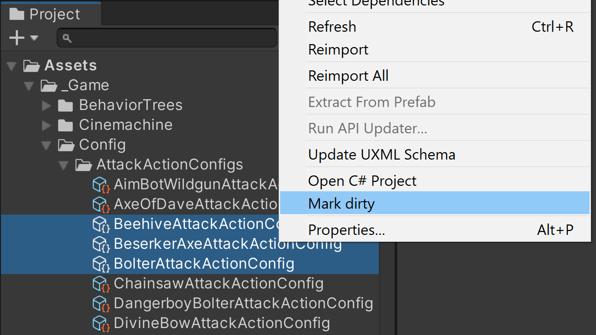

# Dirty Boy

Unity editor utility to manage dirty status of assets

Adds a "Mark Dirty" context option to Unity. Use it to update assets after modifying their fields in code.

## Installation

### OpenUPM

```
openupm add com.nomnom.project-window-extensions
```

### Package Manager

Add via git url:

```
https://github.com/rhys-vdw/dirty-boy.git
```

## Usage

Right click on any asset or GameObject and select "Mark Dirty" from the context menu.



Saving the project after marking as object dirty will cause Unity to reserialize it.

## Contributing

Issues and PRs accepted at https://github.com/rhys-vdw/dirty-boy

## License

[MIT](https://github.com/rhys-vdw/dirty-boy/blob/master/LICENSE)