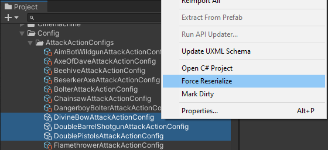

# Dirty Boy

Unity editor utility to manage dirty status of assets.

## Installation

### OpenUPM

```
openupm add computer.rhys.dirty-boy
```

### Package Manager

Add via git url:

```
https://github.com/rhys-vdw/dirty-boy.git
```

## Usage

### Manual use

Right click on any asset or GameObject and select "Mark Dirty" or "Force Reserialize" from the context menu.



Saving the project after marking an object dirty will cause Unity to reserialize it.

### ScriptableObject script watcher

Any time you modify a class inheriting from `ScriptableObject` those assets will be automatically marked dirty.

## Contributing

Issues and PRs accepted at https://github.com/rhys-vdw/dirty-boy

## License

[MIT](https://github.com/rhys-vdw/dirty-boy/blob/master/LICENSE)
